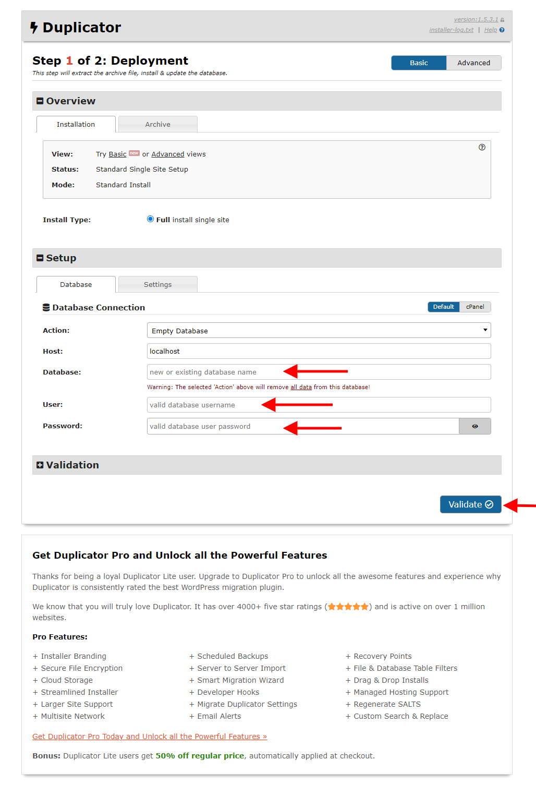
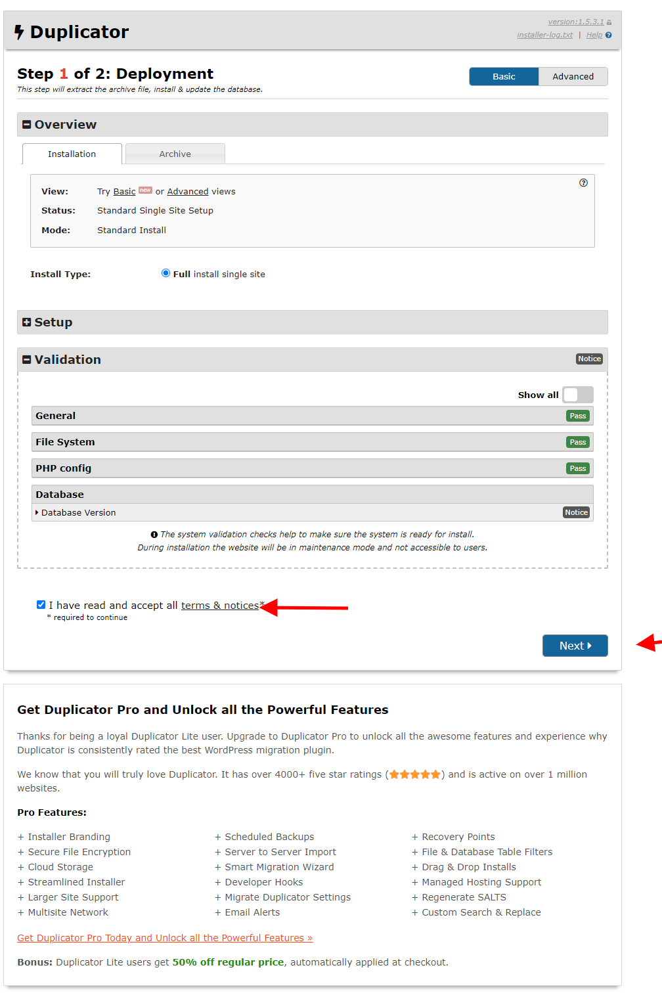
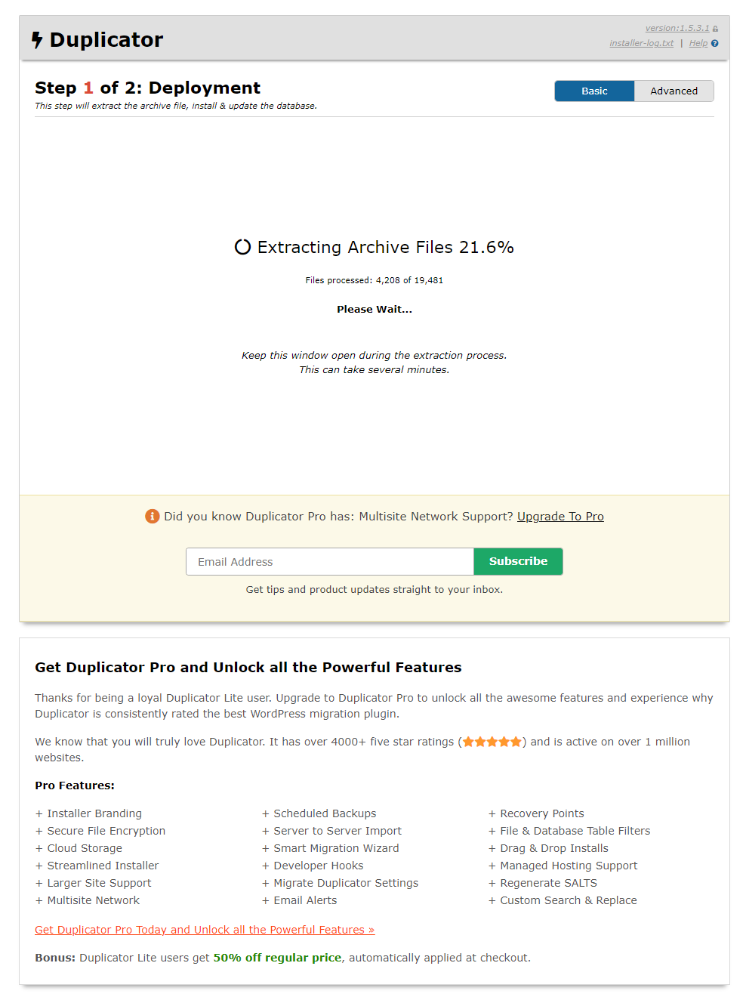
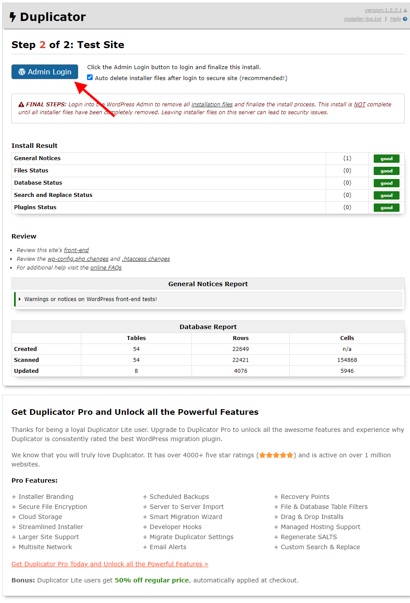

# Step to install this Project 

###  1. Make a mysql Database 

###  2. Keep following 2 file in server root which given through google drive 
1. `Anticipate247_backup_on_april_21_4d8c37af132fc88a2857_20230427215012_archive.daf`  
2. `installer.php`

### 3. Now access `installer.php` file from your webdomain
```
your-domain/installer.php
```

### 4. You will see following page where you will put your database credential (red marked). and clicked on `validate` button



### 5. You will get following page after validate first page, Here you will clicked on `next` button



### 6. After clicked on `next` button following Image will appear. where it will extract file and setup wordpress for you



### 7. Finally you will see following page when wordpress installer is completed.

     

If you click on `Admin Login` (red marked) button it will take to the wordpress login page.    

Wordpress credential will share with you through whatsapp.     
Thank You      


